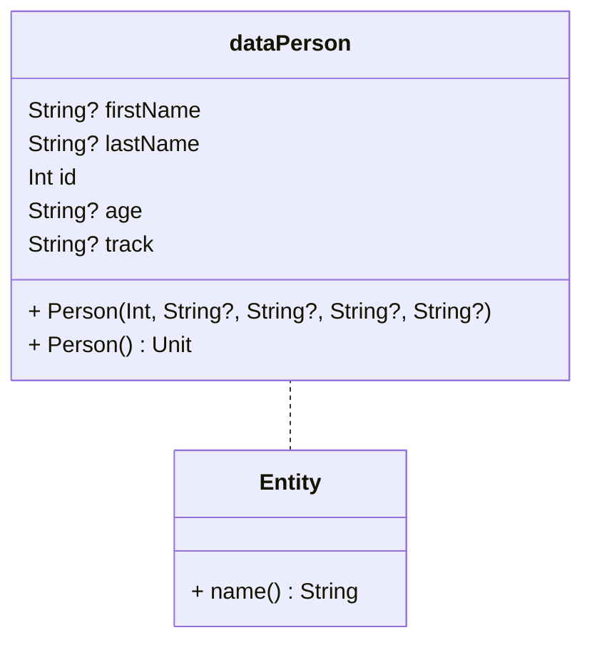
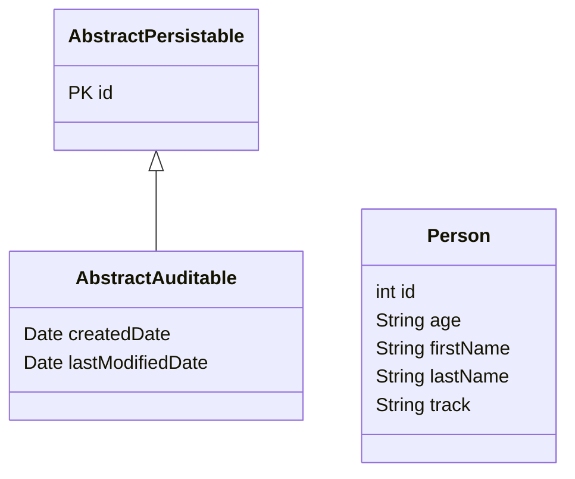

# Class Diagram

```mermaid
classDiagram
direction BT
class Entity {
  + name() String
}
class data  Person {
  + Person(Int, String?, String?, String?, String?) 
  + Person() Unit
   String? firstName
   String? lastName
   Int id
   String? age
   String? track
}

Entity  ..  data  Person 

```

# Entity Relationship Diagram

```mermaid
classDiagram
    direction BT
    class AbstractAuditable {
        Date  createdDate
        Date  lastModifiedDate
    }
    class AbstractPersistable {
        PK  id
    }
    class Person {
        int  id
        String  age
        String  firstName
        String  lastName
        String  track
    }

    AbstractAuditable  --|>  AbstractPersistable

```